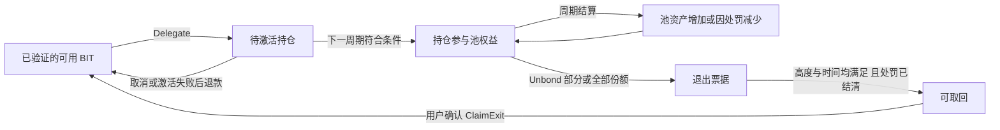
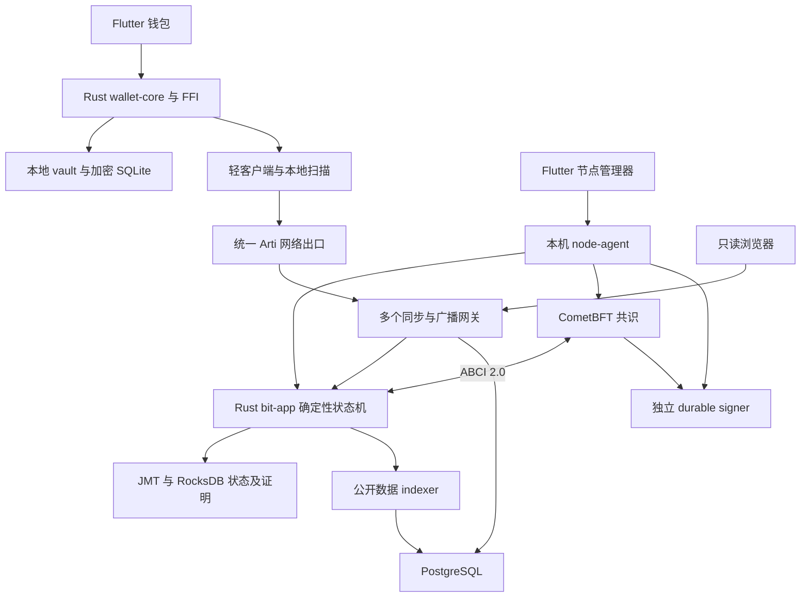

# BIT 项目梳理与总体开发方案

日期：2026-09-08。状态：开发前梳理与建议方案，供讨论和后续落地使用。

本文依据 [BIT v1.2 主规格](D:/others/BIT/docs/BIT_完整开发规格_Codex版_v1.2_1024亿固定总量.md) 和 `docs/solo` 下的分章、接口、配置、任务及参考模型整理。原规格中“立即开始开发”的启动提示是资料内容；本次执行范围是梳理项目与制定方案。本文中的实施调整属于建议，不构成主网经济政策批准。

配套阅读：[规格差异与待决策清单](D:/others/BIT/docs/BIT_规格差异与待决策清单.md)。

后续更新：用户确认后已完成第一轮桌面技术实验，Android 按要求跳过。结果见 [第一轮技术验证报告](D:/others/BIT/docs/BIT_第一轮技术验证报告.md)。本文末尾的核验记录保留为此前梳理阶段的历史范围，不代表技术实验的最新进度。

## 1. 项目到底要做什么

BIT 是一条以**私密支付和原生质押**为核心的独立 PoS 公链。它需要自行维护创世、账本、验证者集合、交易确认、发行与网络运行，并提供普通用户能使用的钱包和节点软件。

产品可以用一句话描述：**用户用本地密钥保管 BIT，扫码进行私密收付款，也可以把 BIT 委托给验证者参与网络安全；验证者运行节点获得符合协议规则的奖励。**

整个项目有三个用户可见产品，以及支撑它们的链和基础设施：

| 交付部分 | 服务对象 | 要完成的事情 |
|---|---|---|
| BIT 钱包 | 普通持币者、委托者、商家、验证者运营者 | 创建与恢复、收付款、对账、质押、退出、资金授权 |
| 家庭节点管理器 | 验证者运营者、普通节点用户 | 安装、诊断、同步、注册、运行监控、升级与迁移 |
| 只读区块浏览器 | 用户、开发者、网络观察者 | 查看公开区块、交易状态、验证者和发行总账 |
| 原生链核心 | 所有节点 | 共识、真实证明验证、确定性执行、状态保存与资金守恒 |
| 公共服务与开发工具 | 钱包、节点、运维、外部接入方 | 同步、广播、证明、归档、快照、CLI、部署与发布 |

当前工作目录只有资料和参考程序；没有 Rust 链工程、Flutter 应用或可运行的完整网络。现有任务状态全部为 `NOT_STARTED`。应把当前阶段理解为“规格较详细，工程尚待启动”。

### 1.1 产品边界

从主规格继承的核心要求：

- 独立原生链，唯一可流通原生币为 BIT，工程前缀为 `bit`。
- 8 位精度，`1 BIT = 100,000,000 ubit`。
- 历史累计发行上限为 1024 亿 BIT，包含创世和后续新增；销毁不恢复发行额度。
- 普通支付使用真实隐私证明；质押使用独立公钥控制的原生持仓。
- 钱包非托管，无身份注册，无手机号、邮箱和生物识别流程；使用本地密码和恢复备份。
- 家用电脑可以申请验证资格，手机可以委托；资格和奖励取决于权益及实际共识规则。
- 完整范围包括钱包、节点管理、浏览器、恢复、部署、升级与验收。

范围外的产品能力包括：通用智能合约、其他可发行资产、可转让质押凭证、跨链桥、DEX、借贷、NFT、法币兑换、托管账户、邀请返利和保证收益。外部平台原生充提接入所需的 CLI/SDK 属于工具范围，平台经营与流动性不属于本项目交付。

### 1.2 三类事项必须分开

| 类别 | 例子 | 后续如何处理 |
|---|---|---|
| 主规格中的硬要求 | BIT 命名、1024 亿累计上限、独立单币、非托管、隐私支付 | 所有模块统一遵守；本次不重新打开这些选择 |
| 工程选型与建议参数 | CometBFT/Rust/Flutter、epoch 减半算法、5 秒目标块速、64 个席位 | 保留为候选基线，用实际集成与评估冻结 |
| 尚未批准的主网输入 | 创世数量及名单、减半周期、正式经济参数、运营者、公钥、审查与发布签名 | 单独登记；开发用隔离测试配置，主网预检不回退到测试值 |

主规格对技术路线已有较明确选择，但“规格指定”不能代替“整套组件已经兼容”。参数也不能因为在多张表中重复出现，就变成已批准的主网政策。

## 2. 用户和资金如何完成一个闭环

### 2.1 普通用户：创建、入金、支付

创建本地钱包 → 设置密码 → 保存并核验恢复凭证 → 获取收款地址 → 接收初始资金 → 本地扫描并验证到账 → 扫码付款 → 确认金额与费用 → 本地生成证明及签名 → 广播 → 验证结算。

首次获得主网 BIT 的来源只能是有效创世权益或已有持币者转账。测试水龙头与主网严格隔离。PoS 网络启动时需要已有币及初始验证权益，创世分配是网络启动设计的一部分。

付款显示应明确区分“已广播”“已入块，验证中”“已确认”。网络超时保留原交易，先查询或重播同一份签名数据；改变金额、费用或重建付款必须重新确认，避免重复付款。

### 2.2 委托用户：质押、奖励、退出



每次创建持仓生成独立控制密钥，链上持仓份额不提供所有权转移交易。委托本金进入协议管理的池，不进入运营者可任意支出的个人钱包。

奖励进入池资产，用户份额数量通常不变，其对应价值随奖励、费用及罚没变化。只有实际活跃集合中符合条件的权益获得相应奖励，钱包离线不会影响链上权益计算。

退出是两次链上动作：先解除质押，再在成熟后领取。成熟必须同时满足区块高度、链上时间和处罚结算条件。钱包离线不丢失领取权；到期状态也不能自动当作可花费余额。

需要显式表现的例外：

- 待激活持仓不赚过去周期奖励；目标验证者失去资格时本金可退款。
- 退出部分从请求生效时停止参与奖励；规格选择不单独追补本周期未结算收益。
- 所有可用币都已质押时，允许退出价值承担退出及领取手续费；粉尘不足时仍需补费。
- 普通短时离线不罚本金，但影响奖励，达到条件会暂停资格；重大可证明违规按规则罚没。
- 活跃池承担尚未披露的历史违规风险；新激活委托也可能受到随后公开的证据影响。
- 最后一个合格运营者不能通过主动操作清空验证集合；普通委托者的退出按自身规则处理。

### 2.3 验证者：运行节点与资金授权分开

安装管理器 → 检测设备、磁盘、网络和运行时 → 验证快照并同步 → 生成独立共识身份 → 手机核对注册请求 → 授权注册及自质押 → 成为候选 → 按有效权益进入活跃集合 → 监控签名、佣金、升级与处罚状态。

这里至少有三种不同权限：支付密钥控制钱包币；operator 密钥管理验证者；consensus 密钥负责共识投票。各持仓另有 owner 密钥。在线节点不获得用户资金密钥。

注册/轮换包含手机与节点之间的多轮已认证交换：初始配对证明和最终交易效果签名是不同的授权。应做成明确状态机，不能把整个协议压成“扫一次码即完成”的前端假设。

节点迁移必须管理最新防双签状态并停用旧签名器。公共快照用于同步链状态，不用于覆盖本机共识签名水位。

### 2.4 商家与恢复

商家在本地生成发票，并用钱包扫描结果匹配订单；少付、多付、迟到与重复付款分别显示。退款需要新交易和本地授权。

换机时使用恢复凭证重建支付、持仓和运营权限，再从经过验证的通用历史数据恢复权益。持仓恢复依赖加密收据携带随机派生信息，不能依赖丢失设备上的地址计数器。联系人、订单标签和未上链备注依赖独立加密备份。

恢复用户资金与恢复安全可用的在线共识签名状态是两个流程，产品必须分别说明。

## 3. 隐私到底覆盖什么

| 信息 | 预期边界 | 对产品的影响 |
|---|---|---|
| 普通支付金额、收款地址、输入所对应旧票据 | 对普通链观察者隐藏 | 钱包本地扫描；浏览器无个人明文流水 |
| 交易时间、大小、输入输出数量、手续费、业务类型 | 可观察 | 文案说明关联风险 |
| 质押金额、验证者、持仓公钥、持仓和退出生命周期 | 公开且可关联 | 委托确认页必须显示公开范围 |
| 钱包总资产、恢复词、查看密钥、联系人 | 留在本地，服务端无资金权限 | 网关不提供个人余额账户体系 |
| 钱包链请求网络出口 | 默认经 Tor，无静默直连 | Tor 不可用时显示不可连接；端点切换仍保持该策略 |
| 验证者网络位置、交易对手已掌握的现实信息 | 不提供完整隐藏保证 | 节点与支付隐私说明分别编写 |

所以产品承诺应具体表达为“私密支付、无身份注册、非托管、公开边界明确的质押”。“所有行为完全匿名”超出了当前设计。

轻客户端能验证收到的数据是否正确，无法迫使服务器提供数据；多服务和归档提高可用性，仍需实际独立运营。超过信任期的长期离线钱包还需要重新建立检查点信任。

## 4. 发行和会计模型

### 4.1 1024 亿是累计发行额度

```text
M = 102,400,000,000 BIT
  = 10,240,000,000,000,000,000 ubit

G0 = 创世实际发行量
Mint = 创世后的累计实际新增
I = G0 + Mint                       历史累计发行
Burn = 累计销毁
T = I - Burn                        当前存量
K = 到期后永久不再发行的配额
Future = 尚未到期的未来预算

I <= M
M = I + K + Future
```

未来预算尚未发行，不属于团队、用户或“社区资产池”，不能提前质押。创世领取只是将已经计入发行的权益变为可用币，不重复增发。销毁只减少当前存量，不能按 `M - T` 重新补币。

链还要维护同一枚 BIT 在各容器之间的位置：

| 符号 | 容器 |
|---|---|
| Q | 私密池总资产 |
| P | 各质押池资产 |
| D | 待激活或待退款本金 |
| X | 各退出池资产 |
| C | 运营者待领取佣金 |
| F | 待分配费用及整数余量 |
| G | 未领取创世权益 |

每次提交满足 `T = Q + ΣP + D + ΣX + ΣC + F + G`。公开总账不要求公开每个用户的私密余额。

金额总上限的原子值已超过有符号 64 位整数。建议沿用规格：Rust 使用 checked U128，乘除中间值使用 U256；JSON/FFI 用十进制字符串；公开索引使用 NUMERIC；前端不能转成浮点数。共识投票权按固定单位换算后单独检查边界。

### 4.2 建议发行算法与主网参数分开

主规格建议将 `B=M-G0` 按 epoch 分阶段减半。设每阶段有 H 个 epoch，e 为已结算数量：

```text
k = e // H，r = e % H
Rk = floor(B / 2^k)
Ak = Rk - floor(Rk / 2)
U(e) = B - Rk + floor(Ak * r / H)
本期配额 = U(e+1) - U(e)
```

这个方案逐步分配有限预算，以整数差分处理尾差。当前测试参考是 1 亿 BIT 创世、720 块一个 epoch、35,040 个 epoch 一个减半阶段；5 秒目标块速下约四年。**这些数值尚未批准为主网政策。**

链按共识高度结算，不按电脑日期发币。上一 epoch 在下一 epoch 首块结算，先分旧周期奖励，再激活新委托；停链不额外推进时间表。

有合格权益时，本期配额与已累积手续费按实际有效签名权重分配到池与佣金。无合格权益时，按建议政策将该配额记为永久未发 K，已有费用保留。新增配额最终归零后，网络继续按规则分配手续费；不承诺固定收益。

### 4.3 手续费与持仓价值

手续费由交易字节数、证明数及业务附加费确定，确认前显示总扣款。费用在容器之间转移，不天然构成销毁。

质押池资产为 P、份额为 S，新增委托 D 通常获得 `floor(D*S/P)` 份；用户持仓价值为 `floor(用户份额*P/S)`。首次入池和最后全部退出有明确边界，最后一份需要处理剩余资产，避免无主尾差。

开发重点是将“公开动作释放/锁定金额”同时纳入真实绑定签名和链状态校验。Python 里加减正确，不能代替交易的权限与密码学守恒。

## 5. 建议架构和模块责任

沿用原规格的分层路线，先对关键组合做技术验证，再冻结生产依赖。



图中的 PostgreSQL 服务只提供可重建公开读模型；钱包确认资产的依据是经过验证的链状态。箭头表示组件调用或数据方向，不代表网关可以授权资金。

| 模块组 | 建议实现 | 唯一责任和主要验收 |
|---|---|---|
| 协议基础 | `bit-types`、`bit-crypto-adapter` | 金额、规范编码、域隔离、上游原语适配、真实正负证明 |
| 链执行 | `bit-state`、`bit-app`、`bit-shielded` | 原子状态、ABCI、交易执行、票据树、nullifier、重放一致 |
| 经济与质押 | `bit-staking`、`bit-emission` | 持仓、退出、处罚、发行、费用及每块会计不变量 |
| 客户端核心 | `bit-light-client`、`bit-wallet-core`、`bit-wallet-ffi` | 头和状态证明、密钥、扫描、计划、签名、恢复、统一网络 |
| 节点运行 | `bit-signer`、`bit-node-agent` | 防双签、进程生命周期、本机权限和授权包交换 |
| 公共读写入口 | `bit-gateway`、`bit-indexer` | 通用同步、广播幂等、公开证明、索引重建 |
| 用户界面 | 钱包、节点管理器、浏览器 | 展示真实状态、用户确认、异常恢复、跨平台适配 |
| 交付工具 | `bit-cli`、部署及发布工具 | 可复现网络、创世校验、安装、升级、证据检查 |

Rust 是签名、金额、交易计划和业务规则的共享实现。Flutter 负责交互，React 浏览器负责公开展示；它们不能各自维护另一套权威余额或奖励算法。共识代码不能依赖 HTTP、系统时间、索引数据库或本机随机数。

### 5.1 上游复用的实际边界

Penumbra v2.1.1 的官方构建文件固定 CometBFT 0.37.18；其 Cargo 工作区还包含完整应用、DEX、IBC 等组件。因此 BIT 的工作是选择所需原语并适配自定义应用，不是整包替换品牌即可运行。这一判断来自本次核对的 [官方 flake.nix](https://raw.githubusercontent.com/penumbra-zone/penumbra/v2.1.1/flake.nix) 和 [Cargo.toml](https://raw.githubusercontent.com/penumbra-zone/penumbra/v2.1.1/Cargo.toml)。

CometBFT v0.38.23 的官方规范明确 H 高度返回的验证集合更新在 H+2 生效，证据过期同时涉及时间和块数条件。BIT 的奖励、处罚及退出责任必须共享这些边界，并在实际进程中验证。[官方应用要求](https://raw.githubusercontent.com/cometbft/cometbft/v0.38.23/spec/abci/abci%2B%2B_app_requirements.md)

文档里的 Rust、Flutter、CometBFT 等精确版本仍作为参考记录。本次没有进行整栈构建或完整安全通告适用性审查；D-001 需要以源码提交、锁文件和目标平台构建结果确定最终组合。

### 5.2 平台落地顺序

最终钱包范围：Android arm64、iOS arm64、Windows x64、macOS arm64/x64、Linux x64。节点范围：Linux x64/arm64、macOS arm64/x64；Windows 通过受管理的 WSL2 运行节点。

建议链和服务先以 Linux 为集成基准，当前 Windows 作为开发宿主并使用 WSL2；Android 真机和一台普通桌面设备尽早用于钱包验证。iOS/macOS 的 Rust、Flutter、SQLCipher 和 Arti 编译可行性也应在依赖阶段验证，完整 UI 可按后续里程碑完成。不能等最后打包时才发现平台依赖无法构建。

完整平台支持需要对应设备、构建环境和分发条件，当前 Windows 环境的结果不能代表其余平台已验收。

## 6. 开发顺序：先消除影响全局的未知

建议保留 D-001～D-030 的可追踪编号，补一个“规格基线整理”前置任务，并拆分过于靠后的基础工作。各阶段都是完整产品的内部实施里程碑，正式功能范围保持不变。

| 阶段 | 对应任务 | 具体产物 | 阶段完成门槛 |
|---|---|---|---|
| S0 统一开发基线 | 新增前置任务 | BIT 1.2 分章、合同、配置、任务、向量与差异记录 | 活跃开发目录中无旧发行入口；各合同互相一致；缺失项明确登记 |
| S1 技术可行性验证 | D-001～D-004，提前抽取 D-010/011/013/019 的验证部分 | 依赖锁候选、真实证明小程序、状态证明与重放实验、平台编译、Arti 与 signer 验证 | 关键原语可用，真实负例被拒绝；平台/协议阻断有事实依据 |
| S2 链的核心资金闭环 | D-005～D-009，提前最小 CLI 与 localnet 启动工具 | 4 套独立 app/CometBFT/signer、真实支付、质押、发行、退出、处罚 | 两用户资产闭环成功；每块守恒；重放不重复发行；真实故障影响共识 |
| S3 钱包与可验证服务 | D-010～D-013、D-022，以及早期 CLI 扩展 | vault、扫描、恢复、交易计划、FFI、完整公开网关 | 种子恢复权益；假数据/漏收据被发现；未知付款不重付；Tor 无静默降级 |
| S4 完整用户产品 | D-014～D-018、D-019～D-021、D-023～D-025 的剩余工作 | 钱包 41 页、节点 16 页、浏览器 8 页、完整 CLI | 页面连接真实内核；异常状态、语言、主题、辅助访问和资金流程有覆盖 |
| S5 全量集成与发布候选 | D-026～D-029 | 全平台构建安装、部署、升级、故障、隐私及性能报告 | 完整验收矩阵逐项有结果；不可复现或未执行项单独列出 |
| S6 主网准备与正式发布 | D-030 及外部输入 | 真实经济政策、创世、审查、独立基础设施、签名发布清单 | 软件验收及真实外部条件均满足；预检通过后才有主网发布资格 |

### 6.1 最先做的四项技术验证

1. **证明与单币闭包。** 真实生成、验证 Spend/Output；验证非本币正价值无法从任何合法入口产生；检验新增原生动作的价值符号、授权和 effect hash。产物是代码、固定向量、参数来源和差异说明。
2. **ABCI、状态和签名器。** 验证 H/H+1/H+2、FinalizeBlock/Commit 崩溃重放、相同区块得到相同根，以及 signer 在断电后拒绝冲突签名。产物是独立进程日志和状态比较。
3. **手机证明与扫描。** 在真机测典型付款证明耗时、峰值内存、参数体积、后台恢复和历史扫描速度，覆盖实际 Tor 链路。产物是设备、负载、流量和失败条件报告。
4. **BIT 新货币模型。** 先补齐独立减半 oracle，再对 Rust 执行器做差分；覆盖累计发行、销毁、永久未发、首末 epoch、手续费模式和重放。产物是可运行向量及测试，不能沿用旧年率模型作为权威。

四项应在大规模界面铺开前产生结果。界面信息结构与设计稿可以同步整理，但底层资金能力以真实验证结果为准。

### 6.2 原任务安排需要调整的地方

- D-005 的真实网络依赖 signer，而 D-019 又依赖 D-005。建议把 D-019 拆为早期签名器核心和后期故障/管理集成，重建无循环的任务关系。
- D-017 才出现完整 Arti 工作过晚。统一网络出口属于钱包基础架构，应在轻客户端、同步与 vault 集成前固定。
- D-025 的最小 CLI 和 D-026 的最小 localnet 启动器需要前移，供核心模块反复验证；完整命令与打包验收仍保留原任务。
- D-027～D-029 承担最终全量验收，资金、隐私和性能测试则从相应模块首次出现时持续执行。
- D-009 要把“固定累计发行、减半、永久未发和完整供给证明”写进验收，不能保留笼统的旧版“确定发行”。

本次只记录这些调整，尚未修改旧 `tasks.json` 或执行状态。

## 7. 重点风险及具体处理

| 风险 | 对项目的影响 | 应采取的动作 |
|---|---|---|
| 新主规格与旧机器合同混用 | 开发出旧通胀链、旧签名域和缺字段接口 | S0 统一版本，建立单一配置与生成来源 |
| 上游密码学组合尚未验证 | 能编译但无法保证真实守恒或单币约束 | 先做窄适配、负例和独立差异审查 |
| 集合延迟/双期限理解不一致 | 错奖、错罚或过早释放资产 | 共享有效集合函数，跨高度与故障测试 |
| 加密收据或归档数据不完整 | 换机后找不到持仓和退出权益 | 原始数据编码冻结，故意漏数据测试，独立历史源 |
| 手机全量扫描与容量目标冲突 | 日常流量、长离线恢复不可接受 | 测真实 compact 尺寸，以用户预算反推正式吞吐 profile |
| 防双签状态被复制或回退 | 验证者受罚，影响委托资金 | 单写者、持久化签名状态、停旧机迁移与键轮换 |
| 多平台构建直到末期才做 | 核心组件在 iOS/桌面不可用 | S1 先做平台编译矩阵和关键真机验证 |
| 后期费用收入不足 | 验证者与归档/查询服务缺少持续运营激励 | 主网经济评估纳入低费用、低活跃权益和服务成本情景 |

手机同步是需要明确量化的一项：若每笔 compact 数据按十进制 1 KB、全网持续 20 TPS，则约为 **1.728 GB/日、630.72 GB/年**，尚不含 Tor、头、证明等开销。这是条件计算，不是实测。如果要求一天数据在 60 秒内补扫，仅下载就约需 230.4 Mbps 有效带宽，再加验证计算。因此“20 TPS 压力目标”与“常用账户 60 秒补扫”必须注明各自测试负载，不能被当成同一场景已经兼容。

### 7.1 项目组织和排期方法

需要覆盖协议/密码学、Rust 状态机、Flutter 多平台、服务/索引、节点运维和安全验证这些职责。独立审查与独立构建证据应与实现职责分开组织。

当前缺少目标设备、可投入资源、正式容量和关键适配实测，不能据现有 30 个任务直接承诺可靠工期。建议先完成 S0/S1，用测得的阻断和各任务实际复杂度估算后续时间，再维护每个里程碑的依赖、负责人、产物和验收证据。

## 8. 开发前需要落定的事项

立即需要解决的是规格和工程合同，不需要先替主网分配真实币：

1. 以 BIT v1.2 为主线建立完整开发基线；保留 Solo 包作为历史参考。
2. 补齐新发行的可运行模型、OpenAPI/Schema/SDK、验收矩阵和任务合同。
3. 固定创世清单、compact 记录、恢复收据、检查点和节点授权包的规范编码。
4. 确定可用的构建环境与首批测试设备，并安排平台验证。
5. 为典型用户设定日常流量、补扫时间、历史恢复和家庭节点磁盘增长预算。

主网决策可以在软件开发过程中形成，但必须在主网配置冻结前完成：创世 G0 与分配、公钥和锁定类型、减半 H/L 与永久未发政策、委托和自质押门槛、费用及罚没参数、独立验证者/网关/归档/检查点来源、长期运营预算、审查及签名发布材料。详细登记见配套清单。

## 9. 如何判断后续工作真的完成

“开发基线完成”意味着资料和合同一致、缺失已补齐、关键编码可复现；“核心链完成”意味着真实共识与真实证明上的资金闭环成立；“完整产品完成”意味着全部平台和页面接通真实能力并通过适用验收；“主网可发布”还需要真实经济输入、独立审查及运营与签名材料。

至少保留三条最终资金验收：

- 创建与备份 → 入金 → 私密支付 → 验证到账 → 质押 → 多周期奖励 → 部分退出 → 成熟领取 → 再次支付 → 新设备恢复。
- 所有可用币锁定 → 从退出价值付手续费 → 等待 → 领取后恢复可用余额。
- 真实违规证据 → 分批处罚及崩溃恢复 → 池/退出/总供给一致减少 → 禁止抢领和重复扣罚 → 剩余权益可恢复与退出。

本次已完成资料对照、差异梳理、旧包摘要核对、20 项旧整数模型测试复跑，以及 BIT 文内 11 个发行检查点和政策字节哈希核对。产品构建、多节点网络、真实密码学、UI、性能和外部审查仍未执行。具体证据范围见配套清单；原文中的历史“通过数量”未转记为本次产品进度。
